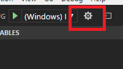

# Test sample for vscode/cmake/cmake tools

A simple demo to use vscode to invoke cmake and debug c program 

# Setup

* Install [vscode](https://code.visualstudio.com/download)

In Windows, you can click the check boxes to enable launch in File Explorer


* Install vscode extentions (through vscode left menu)
    * C/C++ for Visual Studio Code
    * CMake For VisualStudio Code
    * CMake Tools

```
NOTE:
    There is a little issue in CMake Tools, it has to disable cmake server to make the 
    left-bottom cmake tools button work. ex:

    In vscode, open File--> Settings, in "WORKSPACE SETTINGS" add the following configuration line to disable
    cmake server.  It should restart vscode to activate the change.

    {
    ...

    "cmake.useCMakeServer": false
    ...
    }
```


# Build

Click the cmake region and select the debug option in listed menu.


# Debugging

Click the "bug" icon.


While launching the debuging process by click the "bug" icon, (the version of vscode is v1.12.2, CMake Tools 0.9.7), the output message of "printf" function will not showed in the "Debug Console".  No idea it is configuration problem or something else, TBC.

If it is needed to check the output message, it can be achieved by configuration 
the vscode's launch.json.



Click the "wheel" icon and modify the path of execution file.

```
{
    "version": "0.2.0",
    "configurations": [
        {
            "name": "(Windows) Launch",
            "type": "cppvsdbg",
            "request": "launch",
            "program": "${workspaceRoot}/build/test/debug/cmaketest.exe",
            "args": [],
            "stopAtEntry": false,
            "cwd": "${workspaceRoot}",
            "environment": [],
            "externalConsole": true
        }
    ]
}
```

While click the '>' icon, the vscode will spawn a external console to show the output
messages.
