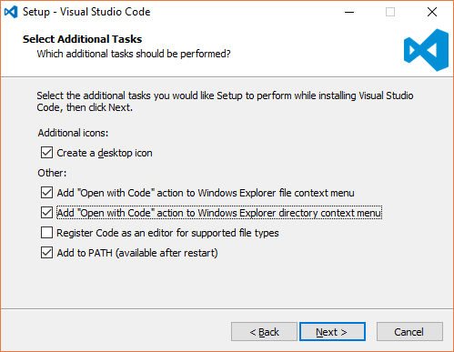
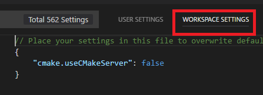
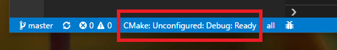
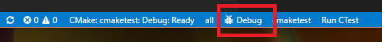

# Test sample for vscode/cmake/cmake tools

A simple demo to use vscode to invoke cmake and debug c program 

# Setup

* Install [vscode](https://code.visualstudio.com/download)

In Windows, you can click the check boxes to enable launch in File Explorer



* Install vscode extentions (through vscode left menu)
    * C/C++ for Visual Studio Code
    * CMake For VisualStudio Code
    * CMake Tools

```
NOTE:
    There is a little issue in CMake Tools, it has to disable cmake server to make the 
    left-bottom cmake tools button work. ex:

    In vscode, open File--> Settings, in "WORKSPACE SETTINGS" add the following configuration line to disable
    cmake server.  It should restart vscode to activate the change.

    {
    ...

    "cmake.useCMakeServer": false
    ...
    }
```



# Build

Click the cmake region and select the debug option in listed menu.



# Debugging

Click the "bug" symbol.




